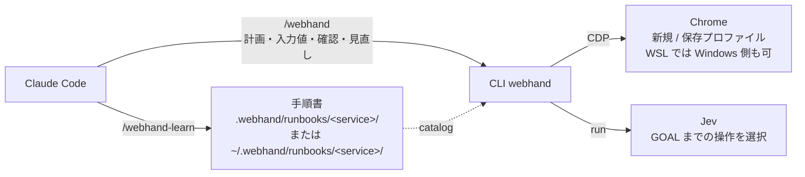

# webhand リファレンス

[English](reference.md) | 日本語

[README](../README.ja.md) の詳細です。保存場所、役割分担、セッション、コマンド、学習モード、ページの領域、ログを説明します。

## 保存場所

Claude Code の `~/.claude/` と `.claude/` と同じように、ユーザー単位とプロジェクト単位の2か所を使います。

| 場所 | パス | 内容 |
| --- | --- | --- |
| ユーザー | `~/.webhand/`（`WEBHAND_HOME` で変更可） | `runbooks/`（どのプロジェクトでも使うサービス情報と手順書）、`runs/`（実行と学習の記録。ページ本文を含む。`WEBHAND_SCREENSHOTS=1` のときはスクリーンショットも）、`state/`（実行中のセッションと保存プロファイル） |
| プロジェクト | 現在のディレクトリから上にたどって最初に見つかる `.webhand/`（ホームディレクトリで止まる） | `runbooks/`（そのプロジェクトのサービス情報と手順書。git で共有できる） |

- 手順書とサービス情報は、プロジェクト、ユーザーの順に探します。同じ名前ならプロジェクトのものを使います。`catalog` は両方を一覧し、それぞれの出所を `(project)` / `(user)` で示します。
- `learn` は既定でプロジェクトに書きます（`.webhand/` がなければ git のルート、なければ現在のディレクトリに作ります）。`--scope user` でユーザーに書きます。
- ログイン状態と実行記録はユーザー単位にだけ置き、プロジェクトには置きません。API キーはファイルに置かず、環境変数（`TYPESAFE_API_KEY`）からだけ読みます。


```mermaid
flowchart LR
  CC["Claude Code"] -->|"/webhand-learn"| RB["手順書<br>.webhand/runbooks/#lt;service#gt;/<br>または ~/.webhand/runbooks/#lt;service#gt;/"]
  CC -->|"/webhand<br>計画・入力値・確認・見直し"| CLI["CLI webhand"]
  RB -.->|"catalog"| CLI
  CLI -->|"CDP"| CH["Chrome<br>新規 / 保存プロファイル<br>WSL では Windows 側も可"]
  CLI -->|"run"| JEV["Jev<br>GOAL までの操作を選択"]
```

## 役割分担

| 担当 | 役割 |
| --- | --- |
| Claude | GOAL と手順を計画する、入力値を書く、足りない情報を質問する、結果を確認する、計画を見直す、実行を締める |
| Jev | GOAL までの操作ごとに、対象の要素と Claude の入力値のどれを使うかを番号で選ぶ |
| コード | 選択を観測済み要素と Claude の値に限定し、鮮度を確認して実行する。独立検証を行う |

`run` は、次のいずれかの場合にだけ Claude に制御を返します。

| 結果 | 発生条件 | Claude の対応 |
| --- | --- | --- |
| `GOAL_REPORTED` | Jev が GOAL 達成を申告した | ページを GOAL と照合し、`finish` か `replan` |
| `NEEDS_VALUE` | 入力欄に合う値が計画にない | `run --value "ラベル=値"`。わからなければユーザーに聞く |
| `NEEDS_HUMAN` | ログイン、認証コード、CAPTCHA、`[person]` の手順 | ユーザーに依頼し、`run --human-done` |
| `BLOCKED` / `STUCK` / `ATTEMPT_BUDGET` | 進めなくなった | `replan` で再挑戦、`act` で1手補う、または `finish` |
| `JEV_FAILED` | Jev の応答が使えない（何も実行していない） | もう一度 `run`、`replan`、または `act` |
| `UNCERTAIN` | 操作が実行されたかどうか不明 | 繰り返さず、`finish --status error` |

確信度は記録しますが、Jev を止める条件には使いません。

## セッション

| `--session` | 内容 |
| --- | --- |
| `new`（既定） | 一時プロファイル。ログインしていない状態で始まり、終了時に削除されます |
| `profile:NAME` | webhand 専用の保存プロファイル。ログイン状態が次回も残ります |

```bash
webhand profile login work --url https://example.com/login   # 人がログインしてウィンドウを閉じる
webhand profile list
webhand profile delete work
```

普段使いの Chrome プロファイルには接続しません。Chrome 136 以降は、既定のプロファイルへのデバッグ接続ができないためです。保存プロファイルは、Linux では `~/.webhand/state/profiles/`、Windows では `%LOCALAPPDATA%\webhand\profiles\` に置かれます。

### 保存したログイン（`--auth`）

保存したログインは、セッションの Cookie と localStorage を残し、あとの新しいセッションをログイン済みで始められるようにします。保存プロファイルと違い、Chrome に限りません。どのエンジン（Chrome、headless shell、Lightpanda、Obscura）でも、このログインで始められます。

```bash
webhand start --headed --goal ... --url https://example.com/login --step "[person] ログインする"   # 人がログインする
webhand auth save work                       # そのセッションのログインを保存する（--id NAME でセッションを選ぶ）
webhand start --auth work --goal ... --url https://example.com/   # ログイン済みの新しいセッション
webhand auth list
webhand auth delete work
```

- `--auth` は新しいセッション専用です。`--id` や `--session profile:NAME` とは同時に指定できません。
- 保存されるのは、保存したときに開いているタブのサイトだけです（その Cookie と localStorage）。`start` では、開始 URL のサイトの localStorage を戻します。別の origin の localStorage は戻らず、Cookie だけが入ります。その場合は `start` が知らせます。
- ファイルは `~/.webhand/state/auth/NAME.json` で、自分だけが読めます。ログインそのものなので、パスワードと同じに扱い、コミットも貼り付けもしないでください。webhand は中身を表示しません。
- ログイン済みで開いたページは、保存プロファイルと同じく Jev（TypeSafe）に送られます。保存したログインも、ほかのログインと同じく期限が切れます。

### 複数のセッションを同時に使う

セッションごとに、Chrome、プロファイル、計画、履歴が別になります。`start` に `--id NAME`（英数字、`-`、`_`、40文字まで）を付けて名前を決め、そのセッションの以降のコマンド（`run`、`replan`、`act`、`observe`、`finish`）にも同じ `--id` を付けます。`--id` がなければ、これまでどおり `default` です。

```bash
webhand start --id a --goal "..." --url ...
webhand start --id b --goal "..." --url ...    # 2つ目の Chrome。状態は a と別
webhand run --id a
webhand finish --id a --status done
```

- id が `default` でないときは、出力が Claude に次に実行させるコマンドにも `--id` が付きます。`webhand catalog` は、開いているセッションを目標つきで一覧します。
- 1つのセッションで同時に動くコマンドは1つだけです。2つ目は「Session is busy」で止まります（1つの Chrome で `run` が2つ動くと、二重に操作するため）。コマンドが落ちて残ったロックは引き継ぎます。別の id のコマンドどうしは待ち合いません。
- すでに開いている id では `start` できません。同じ保存プロファイルを2つのセッションで使うことはできず（2つ目の Chrome が終了します）、`profile login` は、開いているセッションが使うプロファイルを断ります。
- 実行記録はセッションごとに別です。状態は `state/session-ID.json`、`state/tab-ID`、`state/session-ID.lock` です（default は `session.json`、`tab`、`session.lock`）。
- 未対応: 複数の人やマシンで共有するセッション、1回の `run` で複数のセッションを動かすこと。

**ログイン後のページの内容は Jev（TypeSafe の API）に送られます。** 個人情報を含む画面を扱うかどうかは、実行前に判断してください。

## WSL で Windows 側の Chrome を使う

`--chrome auto`（既定）は、WSL 上で Windows の `chrome.exe` に接続できればそれを使い、できなければ Linux の Chrome を使います。`--chrome windows` または `--chrome linux` で固定でき、`WEBHAND_CHROME` でも指定できます。

Windows の Chrome は、デバッグポートを Windows の 127.0.0.1 で待ち受けます。そのため、WSL のネットワークを mirrored にする必要があります。

```ini
# %USERPROFILE%\.wslconfig
[wsl2]
networkingMode=mirrored
```

設定したら、PowerShell で `wsl --shutdown` を実行して WSL を再起動します。ローカルファイルの URL は `file://wsl.localhost/...` に変換して開きます。

## ヘッドレスシェル

`--engine headless-shell`（または後述の `auto`）で、Chromium の窓のないビルド `chrome-headless-shell` でセッションを動かします。Chrome と同じエンジンなので（実際のレイアウト、複数タブ、コマンドが終わってもページが残る）、常駐プロセスは要りません。メモリは Chrome の `--headless=new` の約半分です。同じ測定で、1 ページあたり 240〜260 MB 前後に対して、350〜470 MB でした（`docs/research-plan.md`）。

- 入れ方: Playwright の `chromium_headless_shell` を、そのブラウザキャッシュ（`~/.cache/ms-playwright`、または `PLAYWRIGHT_BROWSERS_PATH`）から探します。`WEBHAND_HEADLESS_SHELL` にバイナリを指定するか、`chrome-headless-shell` を `PATH` に置いてもかまいません。
- ページは Chrome と同じ 1120x780 です。Chrome の窓には、ブラウザの UI が 87px 含まれます（`--window-size=1120,867`）。シェルには UI がないので `1120,780` で起動します。窓の大きさを同じにすると、別の要素を読んでしまいます。
- 窓も保存プロファイルもありません。`--headed`、`[person]` ステップ、`learn`、`profile` は使えず、`--chrome windows` も効きません。Chrome で作ったプロファイルは、シェルのビルドより新しいことがあるためです。
- 窓も保存プロファイルも要らない実行では、これが既定です（`--engine auto`。既定。`WEBHAND_ENGINE` でも指定できます）。窓（`--headed`）、保存プロファイル、`--chrome windows` のときは Chrome のままで、シェルが入っていないときも、黙って Chrome を使います。`--engine chrome` なら必ず Chrome です。どちらで動いたかは `SESSION:` の行に出ます。

## Lightpanda

`--engine lightpanda` で、Chrome の代わりに [Lightpanda](https://lightpanda.io) でセッションを動かします（`--engine` は `chrome`、`lightpanda`、`obscura`。既定は `chrome`、または `WEBHAND_ENGINE`）。`--chrome auto|linux|windows` は Chrome をどこで動かすかだけを決め、エンジンには効きません。Lightpanda は CDP 接続が終わるとページを失い、webhand はコマンドごとに接続し直します。そこで webhand は小さな常駐プロセス（`src/daemon.ts`）を起動します。常駐が `lightpanda serve` を動かし、セッションの間、接続とページを1つ保ち、セッション用の一時フォルダにある所有者専用の unix ソケット（`state.socket`）でコマンドに応えます。常駐の中で動くのは同じ `Browser` なので、鮮度確認とリトライしない規則は Chrome と同じです。`finish` で常駐と Lightpanda をまとめて止めます。Chrome のセッションは常駐を使いません。

制約:

- 保存プロファイルはありません（`--session new` のみ）。画面もないため、`--headed`、`[person]` ステップ、`learn`、`profile` は使えません。
- `file:` の URL は開けません（ページは http で配信します）。2つ目のタブも開けません。`target="_blank"` のリンクや `window.open` は何も起きず、エラーにもならず、ページはそのままです。そのステップの後に、実行ログへ `window_ignored` イベント（ステップと URL）を残すので、「何も起きなかったクリック」を、拒否されたものと区別できます。Jev に新しい選択肢は出しません。
- レイアウトがないため、要素の位置は模擬で、スクリーンショットはプレースホルダーです。Jev に見せる内容が Chrome と違うので、Chrome との比較は別の実験として扱います。
- `lightpanda` が `PATH` にある必要があります。

## Obscura

`--engine obscura` で、[Obscura](https://github.com/h4ckf0r0day/obscura)（Rust、V8、Apache-2.0）でセッションを動かします。仕組みは Lightpanda と同じで、常駐プロセスが接続とページを保ち、コマンドはセッションのソケットで頼みます。Lightpanda と違い、実際のレイアウト、実際のスクリーンショット、複数ページがあります。

- 入れ方: リリースのアーカイブを展開し（`obscura` と `obscura-worker` を同じ場所に置く）、`WEBHAND_OBSCURA` に `obscura` のパスを設定するか、`PATH` に置きます。
- Obscura は既定で、ループバックとプライベートアドレスを拒否します（SSRF 対策）。ローカルのページを使うときだけ `WEBHAND_OBSCURA_ALLOW_PRIVATE=1` を設定します。実在のサイトでは設定しません。
- 制約は Lightpanda と同じです。保存プロファイルも窓もないので、`--headed`、`[person]` ステップ、`learn`、`profile` は使えません。
- 新しいウィンドウ: `window.open` は何も開かず、Lightpanda と同じく `window_ignored` として記録します。`target="_blank"` のリンクは、新しいウィンドウではなく、同じタブでリンク先を読み込みます（ページが変わるので、`window_ignored` は出ません）。
- タブ: Obscura は複数のページを持ち、webhand はそれらを切り替えられます（`TAB_n`）。ただし、ページの操作で2つ目のタブが開くことはない（上記）ので、実際には1つです。`Page.bringToFront` は未実装で、webhand は、それがなくても切り替えます。
- `<body>` の直下にある inline の要素（段落、ブロック、flex の中でないもの）は、大きさが 0 になり、Jev には出ません。ブロックの中にあれば出ます。
- Chrome にある Web API の一部が、Obscura にはありません。webhand は、次のものをページ側に足します（`compat`。`src/browser.ts`。`assets/snapshot.js` はどのエンジンでも同じです）。反復できる `select.selectedOptions`、`isContentEditable`（編集できる div を `textbox` にするため）、フォームの子要素の名前での参照（`form.guest`）、id でのフォームの参照（`document.forms.id`）。後の2つがないと、ハンドラが `form.guest.value` と読むページは例外になり、フォームが送信されません。足せないもの: スタイルシートの規則で指定した cursor は `auto` と読めます（インラインの style だけが `pointer` になる）。CSS の cursor だけでクリックできる要素は、Jev に出ません。

## コマンド

下の表の `webhand` は、インストールしていなければ `npx -y webhand@0.4` と読み替えてください。`webhand --version` で版を確認できます。

| コマンド | 担当 | 内容 |
| --- | --- | --- |
| `webhand catalog` | Claude | 学習済みのサービス、手順書、保存プロファイルを一覧する |
| `webhand start --goal G --url U --step S ... --value L=V ... --session ...` | Claude | 計画を記録し、Chrome で開始 URL を開く |
| `webhand run` | Jev | GOAL まで操作する |
| `webhand replan --reason R [--step ...] [--value ...] [--focus ...] [--skip ...] [--read ...] [--restart \| --url URL]` | Claude | 計画を見直して、次の試行を始める。開始 URL から（`--restart`）、または別のページから（`--url`） |
| `webhand act OP [TARGET]` | Claude | Jev の代わりに操作を1つ実行する |
| `webhand observe` | Claude | 現在のページを表示する |
| `webhand finish --status STATUS` | Claude | 独立検証、ログ記録、Chrome の終了 |
| `webhand learn --name NAME --url URL [--scope project\|user]` | 人 | 操作を記録する |
| `webhand profile login/list/delete` | 人 | 保存プロファイルを管理する |
| `webhand auth save/list/delete NAME` | Claude | セッションのログインを保存し、`--auth NAME` で新しいセッションを始められるようにする |

手順の先頭に `[person]` を付けると、人が行う手順になります（`--headed` が必須です）。`start` と `replan` の `--focus REGION` / `--skip REGION` で、観測する領域を選べます（下の「ページの領域」）。`--read KIND` で、画面の外の内容を足せます（下の「画面の外を読む」）。`--runbook NAME --param k=v` を指定すると、手順書の GOAL、開始 URL、手順が既定値になり、params は入力値として Jev に渡されます。

## 学習モード

人の操作、サービスのソースコード、または過去の実行ログから、次の2種類のファイルを作ります。

| ファイル | 内容 | 使われ方 |
| --- | --- | --- |
| `runbooks/<service>/service.toml` | サービスの説明、ログインの要否、ページと領域の一覧、Jev 向けの事実 | `catalog` で Claude が読み、`--service` で Jev に渡す |
| `runbooks/<service>/<name>.toml` | 手順書（goal、params、steps、hints、done_when、focus、skip） | Claude の計画の下敷き。手順と hints は Jev にも渡す |

どちらも、プロジェクトの `.webhand/` かユーザーの `~/.webhand/` に置きます（「保存場所」）。`learn` は書き込み先を `WRITE THE RUNBOOK TO ...` として表示します。`start_url` にローカルファイルの相対パスを書くと、その `.webhand/` を含むディレクトリからのパスになります。

```text
/webhand-learn --name myservice/search --url https://example.com
```

1. `webhand learn` が Chrome を開き、ユーザーの操作を記録します。ウィンドウを閉じると終了します。ログインした状態で操作を見せる場合は、`--session profile:NAME` を付けます。バックグラウンドのジョブを止めても（SIGTERM、または npx の終了）、記録を保存して Chrome を閉じます。
2. Claude が記録またはソースコードから、サービス情報と手順書の下書きを書きます。
3. `--runbook NAME --param k=v --allow-draft` で試行します。
4. ユーザーが内容を確認し、`status = "approved"` にします。

手順書は機械的に再生しません。

`sources` は任意の欄で、webhand は読みません。書くのは、誰でもたどれる参照（`code:<パス>@<commit>` など）だけです。実演、実行、試行は書きません。それらのログはユーザー側の `runs/` にしかないためです。実行ログには手順書の `digest` が残る（`run_start` と `run_end`）ので、ある版の手順書を使った実行はログから探せます。ファイルを変えるのは、学習した内容が変わるときと承認するときだけで、試行を記録するためには変えません。何を学んだかはコミットメッセージに書きます。

### まだ学習していない手順

学習済みのサービスであれば、手順書のない手順も実行できます。Claude が catalog から GOAL、開始 URL（サービスのページ一覧から選ぶ）、手順（`--step`）を書きます。`--runbook` がなくても、`--service SERVICE` でサービス情報が Jev に渡ります。

```text
webhand start --goal "..." --url "..." --step "..." --service myservice --session new
```

- そのまま効くもの: サービスの `facts`、`default = "skip"` の領域。
- 使えないもの: 手順書だけが持つ `hints`、`done_when`、`focus`。その分 Claude の計画に頼るため、計画の見直しが増えることがあります。
- 次回も使うなら、その実行から学習させます（次の節）。`draft` の手順書になります。

### 実行から学ぶ

`/webhand` の実行だけでは、学習済みの内容は変わりません。計画を見直した、`blocked` で終わった、手順書なしで `done` になった実行では、Claude がログの場所を伝えます。そのログから学習させられます。

```text
/webhand-learn ~/.webhand/runs/<timestamp>/adhoc.jsonl
```

- Claude は、自分が書いた見直しの理由（`attempt_end`）、`run` が止まった理由（`escalation`）、成功した試行で操作した要素と領域（`step`、`page`）を読みます。
- サービスの性質は service.toml の `facts` に、ひとつの手順に関することは手順書の `hints`、`steps`、`focus`、`skip` に書きます。手順書なしで `done` になった実行からは、新しい手順書を作れます。
- 根拠にするのは Claude の理由とログの構造だけです。ページ本文は使いません。
- 変えた手順書は、`approved` だったものも `draft` に戻ります。試行してから承認してください。

記録の扱い:

- キー入力は記録しません。パスワード、ワンタイムコード、カード番号などの欄の値は `<redacted>` になります。ただし秘匿の判定は欄の属性と名前によるため、見分けられない欄の値は `runs/` の記録に残ります
- URL のクエリの値はすべて伏せます
- 記録はユーザー単位の `runs/`（既定は `~/.webhand/runs/`）に保存されます。ページ本文を含むため、共有しないでください
- iframe 内の操作とファイル選択は再現できないため、`unsupported` として残します
- 新しいタブは `tab` イベント（`opened`、`closed`。開いているタブの数つき。タブが前面に来たときは `switched`）として記録し、その中での操作は、そのタブの URL つきで通常どおり記録します。手順書には、そのタブへ切り替える手順を書きます（[タブ](#タブ)）。`switched` はページから届くので、ページが言えるのは自分のタブが前面に来たことだけです。ヘッドレスの Chrome では見えません
- ページのスクリプトは記録を偽装できるため、記録は信頼せず、手順書はユーザーが承認します

## ページの領域

観測は、テキスト 6000 文字、操作 250 件が上限です。ページは領域（header、nav、main、form、fieldset、table、dialog、ラベル付きの section など）に分けて観測します。領域のキーは、外側の領域からの並びです。

```text
main/form:宿泊予約/fieldset:追加プラン   # 種類:名前。名前は aria-label、legend、caption、領域の先頭の見出しから取る
nav#2                                    # 名前のない同じ種類が並ぶときは順番
```

- 観測結果の `regions` には、領域ごとに位置（`above` / `visible` / `below`）、テキストと操作の表示数と全数、画面外の操作の数が入ります。Claude には `REGIONS`、Jev には `page.regions` として渡ります。何が切り捨てられたかがわかります。
- `focus` の領域は先頭に並び、テキストはページ全体から取ります。`skip` の領域は要約にだけ出ます。どちらもないときは、画面内を DOM 順に取ります。開いた dialog は、view があるときは常に先頭です。
- パターンはキーのどこに一致してもよく、一致した領域の内側も含みます。名前や番号のない段（`form`）は、その種類のどの領域にも一致します。focus と skip の両方に一致したら、深いほうが勝ちます（同じ深さなら focus）。
- 操作の対象は view に関係なく画面内だけです。鮮度の判定（`marker`、`page_key`、`guards`）は、view に関係なく同じ入力から計算します。
- view は、service.toml の `default`、手順書の `focus` / `skip`、Claude の `--focus` / `--skip` の順に重ね、後のものが勝ちます。`run_start` と `plan` のイベントに `view` が残ります。

```toml
# service.toml
[[pages.regions]]
key = "main/form:宿泊予約"
purpose = "予約フォーム"
[[pages.regions]]
key = "footer"
purpose = "サイト共通のリンク"
default = "skip"       # focus か skip。なしなら通常

# 手順書
focus = ["form:宿泊予約"]
skip = ["header", "footer"]
```

学習の記録では、`page` イベントに領域の要約（キーと件数だけ）、`action` イベントに対象の領域キーが入ります。秘密に見える名前の段は `form:<redacted>` になります。

`verify()` のないサービスでは `verified` は `null` です。手順書の `done_when` は Claude の確認材料で、成功の証拠にはなりません。

## 画面の外を読む

Jev と Claude は、ふだんページの見えている部分しか受け取りません。よくあるページでは文章が500字ほどで、ページ全体には数万字あることもあります。`start` か `replan` に `--read KIND`（複数可）を付けると、観測のたびに、ページ全体から選んだ種類の内容を読み取り層として足します。Claude は `run` と `observe` の出力の `READ` で、Jev は `page.read` で受け取ります。

| 種類 | 中身 |
| --- | --- |
| `outline` | 見出しとその階層。`--read` を付けると必ず入る |
| `text` | 表、リスト、見出し、リンク、操作要素の外にある本文 |
| `table` | 表ごとに、題名と、1行ずつの行（セルは ` \| ` で区切る） |
| `list` | 一番外側のリストの項目 |
| `link` | リンクの名前（同じ名前は1回だけ） |
| `control` | 画面外のボタン、入力欄などの操作要素。役割と名前だけ |
| `media` | 画像の代替テキストと図の説明 |

- 読むためだけのものです。この中のものは操作できません。操作の対象と鮮度の確認は、下の `SCROLL_TO` を除いて、これまでどおり見えている部分だけで決まります。`@ below 1200px` のような行は、その後の行がどこにあるかを示します。Jev はこれを見て、正しい方向へスクロールできます。
- 見えている部分にある本文、リストの項目、リンク、操作要素は入れません。画面内の文章と要素に、すでに入っているためです。見出しと表は、全体を入れます。
- 読み取り層は最大12,000字です。種類ごとに同じ量を割り当て、少なくて済む種類の残りをほかの種類に回します。行は途中で切りません。切った種類の最後には `... N more characters` が付きます。
- 読み取り層があるときは、画面外の要素（最大60個。近いものと遠いものを残す）を、`SCROLL_TO` の対象としてだけ、位置（`at="below 1200px"`）つきで渡します。`SCROLL_TO` はその要素を画面の中ほどまでスクロールするだけで、ほかには何もしません。次の観測で、その要素を操作できます。スクロールするたびに項目が増えるリストでは、最後の要素に `SCROLL_TO` すると次の項目が読み込まれます。Claude も `webhand act SCROLL_TO N` で使えます。
- `--skip` の領域は読みません。`--focus` があるときは、その領域（と開いているダイアログ）だけを読みます。
- 入力欄の値は読みません。ページの内容は信頼しないデータとして扱います。
- `replan --read KIND` は種類の指定を置き換え、領域の指定は残します。`--read none` で読み取り層をなくします。`plan` イベントの `view.read` に指定が、`page` イベントの `read` に種類ごとの表示した字数と全体の字数が残ります。
- `--read` を付けなければ、観測、出力、Jev に渡すものは今までと同じです。

## 長い一覧から1つを選ぶ

目標が、一覧から条件で1つを選ぶことなら、`start` か `replan` に `--compare CRITERION`（例: `--compare "lowest monthly price"`）を付けます。各試行の最初の `run` は、何かを操作する前に、一覧全体を比べます。

1. webhand がページの一番上へ戻り、1画面ずつ下へスクロールします（前の画面と120px重ねる）。
2. スクロールのたびに、Jev が条件に一番合う項目を選びます。選択肢は、画面内の要素（その行、カード、リスト項目の文章つき）と、それまでの一番（`KEEP`）です。それまでの一番は文章で覚えておくので、画面外の行を消す一覧でも比べられます。まだ一番がないときは、`NONE` で「まだ合う項目がない」を選べます。
3. 20回スクロールしたとき、またはページの一番下で2秒待っても何も増えないとき（スクロールで増える一覧は、そこで増えます）に止まります。
4. 一番の項目があった位置へ（読み取り層があれば、その項目そのものへ）スクロールで戻り、いつもの手順に進みます。Jev は結果を `plan.compared` で受け取り、その項目を操作するよう規則で指示されます。その試行の残りでは、Jev の目標は GOAL ではなく、その項目になります。

比べている間は、クリックも入力もしません。このスクロールは操作の数に入れません。出力には `COMPARED (N scrolls, ...): 項目` が出ます。ログには、スクロールごとの `compare_round` と、最後の `compare_end` が残ります。比較に失敗したときは `compare_failed` を残し、何も変えません。新しい試行のたびに比べ直します。`replan --compare none` で止めます。スクロールするのはページ全体だけで、ページの中のスクロールする枠は対象外です。

## 長い一覧から条件に合うものをすべて集める

目標に、一覧のうち条件に合う項目がすべて要るなら、`start` か `replan` に `--collect CONDITION`（例: `--collect "200 GB of storage and less than €40 a month"`）を付けます。各試行の最初の `run` は、それらを集めて止まります。

1. webhand が `--compare` と同じ手順でスクロールします。一番上から1画面ずつ下へ進み、20回スクロールしたとき、または一番下で待っても何も増えないときに止まります。
2. スクロールのたびに、画面内の一覧と表の項目（表の行と、同じタグとクラスで3つ以上並んだまとまり。div で組んだカード、リスト項目、記事など。メニュー、ヘッダー、フッター、見出しの行は除き、入れ子になったものは外側のほう、たとえばカードの中の箇条書きではなくカードを読みます）を読みます。まだ見ていない項目は1回ずつ Jev に聞き、その項目の文章から `MATCH` か `NO` で判定させます。Jev に渡すのは計画と条件だけで、ページは渡しません。
3. 合った項目は文章で覚えておくので、画面外の行を消す一覧でも集められます。
4. その試行の残りでは、Jev は GOAL の代わりに、Claude の手順と Claude が書いた値に向かって操作します。GOAL のうち一覧を読む部分は済んでいるからです。手順がなければ GOAL のままです。

集めている間は、クリックも入力もしません。集め終わると `run` は止まります。出力には `COLLECTED (N scrolls, ...): M of S items meet: 条件` と、合った項目が1行ずつ（最初の100件まで）出ます。Claude はそれを目標と照らし合わせ、答えを書きます。答えをページに入れるときは、値として渡します（`run --value 'LABEL=VALUE'`）。次の `run` は、集める前の位置から、いつもの手順に進みます。ログには、スクロールごとの `collect_round` と、件数を記した `collect_end` が残ります。集めるのに失敗したときは `collect_failed` を残し、何も変えません。新しい試行のたびに集め直します。`replan --collect none` で止めます。`--compare` と `--collect` は一緒に使えません。表の行、リスト項目、記事でない項目は読まず、スクロールするのはページ全体だけです。

## ボタンや次のページの先にある項目

`--compare` か `--collect` と一緒に、`start` か `replan` に `--more CONTROL`（例: `--more "Next page"`、`--more "Show more plans"`）を付けると、一覧の続きを出す操作の名前を指定できます。

1. 一覧の終わり（ページで一番長い一覧の最後の項目が画面に入ったところ。その下が見えるところまで先にスクロールします）と、一番下で待っても何も増えないときに、画面内の要素（周りの文章つき）からその操作に当たるものを、Jev が選びます。なければ `NONE` です。この質問では、Jev にページも渡します。同じ場所では1回だけ聞きます。
2. webhand がそれを1回押し、ページが変わる（アドレスが変わる、内容が増える、文章が変わる）のを最大3秒待ってから、今の画面から続けます。変わらないときと `NONE` のときは、一覧の終わりからはそのままスクロールを続け、一番下で止まります。
3. 1回の走査で押すのは10回までです。

押すのは操作なので、繰り返しません。押した結果が不確かなら、`UNCERTAIN` で止まります。`--compare` で一番の項目が前のページにあったときは、そのページを開き直してから（一度開いたページです）、その項目へスクロールします。ボタンで増やした一覧は、そこでは増やし直しません。`--collect` で別のページで終わったときは、そのページの一番上で終わります。出力には `loaded more N times` が加わり、ログには押すたびに、何が変わったかを記した `more` が残ります。`replan --more none` で止めます。`--compare` も `--collect` もないときの `--more` は断ります。

## タブ

クリックで新しいタブが開くことがあります（`target="_blank"`、`window.open`）。webhand は実行を一度に1つのタブに置き、新しいタブは、切り替えるまで観測しません。

- タブが2枚以上開いているときだけ、観測に `TABS: N open, this is tab K` が出て、ほかのタブが操作 `TAB_n`（「Switch to tab n: タイトル」）として並びます。Jev は `SCROLL_DOWN` や `WAIT` と同じように番号で選びます。タブが1枚なら何も変わりません。`webhand act TAB_2` で手動でも切り替えられます。
- 切替は、タブの数、並び、切替先のタイトルが観測時と同じときだけ実行します。違えば何も実行せず、結果は `STALE` です。切替でどのページも変わりません。
- 新しいタブ、閉じたタブ、切り替えたタブは、ページが変わったものとして数えるので、`STUCK` を増やしません。
- 今のタブが自分で閉じたら、残っている最後のタブに移ります。
- 今のタブは、コマンドのたびに Chrome へ接続し直すため、`state/tab` に残して次のコマンドへ引き継ぎます。
- ほかのタブのタイトルは、観測とともに Jev に送られます（ページ本文なので、信頼しないデータです）。保存プロファイルでは、ログイン中のタブも含みます。
- 未対応: タブを閉じる操作と、クリックで開いたタブへの自動切替。

## ログ

ユーザー単位の `runs/<時刻>/`（既定は `~/.webhand/runs/`）に JSONL で出力されます。

| type | 内容 |
| --- | --- |
| `run_start` | 目標、Chrome（linux / windows）、セッションの種類、git commit、手順書、サービス |
| `start_failed` | `start` がページを開けなかった理由（エラーの1行目。URL の値は伏せる）、開始 URL、Chrome、セッションの種類。この実行には `run_start` がない |
| `plan` | 試行ごとの手順、入力値のラベル、その出所（`claude` / `runbook`）、`restart` |
| `call` | Jev の呼び出しごとのトークンと遅延 |
| `step` / `step_result` | 実行した操作、その領域、入力した値のラベル（値そのものは残さない）と `text_chars`、試行番号、判断者、確信度、ページの変化。URL のクエリ値は伏せる |
| `page` | 開始時とページが変わるたびの領域の要約（キーと件数だけ。本文は入れない）。`--read` があるときは、`read` に種類ごとの表示した字数と全体の字数が入る |
| `escalation` | `run` が Claude に返した結果 |
| `human_step` / `values` | 人の手順の依頼と完了、追加された入力値のラベル |
| `attempt_end` | 試行の結果と、Claude が書いた見直しの理由 |
| `handoff` | Claude が読む CLI 出力の文字数 |
| `screenshot` / `screenshot_failed` | `WEBHAND_SCREENSHOTS=1` のときだけ。画像がどの手順と試行のあとか、何のあとか（`start` / `action` / `restart`）、`<ログ名>-screenshots/` 内のファイル、クエリ値を伏せた URL。撮影に失敗しても記録して実行を続ける |
| `page_check` / `page_check_failed` | `start` のあと（`when: start`）と、`run` が `BLOCKED`、`STUCK`、`ATTEMPT_BUDGET`、`NEEDS_HUMAN` で止まったとき（`when: escalation`）。試行、クエリ値を伏せた URL、文書の HTTP ステータス、ページの題名（120文字まで）、見つかったボット確認の目印（`cloudflare`、`recaptcha`、`hcaptcha`、`datadome`、`perimeterx`、`arkose`。目印であって証拠ではない）、表示されている文字数。読むだけで、Jev には送らない。確認に失敗しても記録して実行を続ける |
| `run_end` | 自己申告の状態と Claude の `reason`、サービス、手順書、独立検証の結果、試行回数と試行ごとの結果、`actions`（実行した操作だけ）、`stale` と `not_visible`（実行しなかった選択）、役割ごとの集計 |

成功判定は `run_end.verified` です。`status=done` は申告にすぎません。Claude Code のトークン数は取得しないため、`handoffs`（Claude に戻した回数）と `handoff_chars`（読ませた文字数）を代理指標にします。

